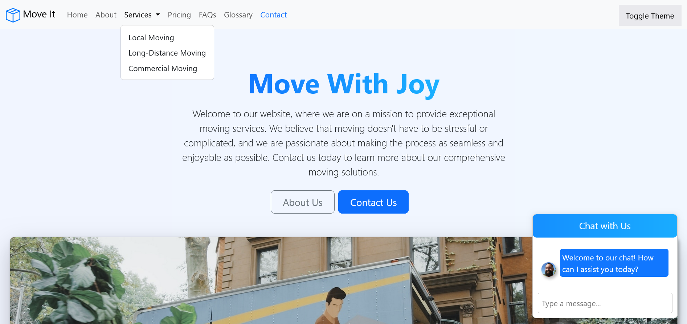
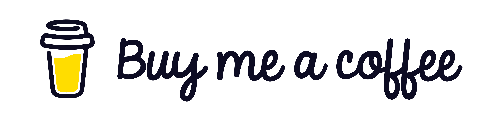

#  Move It

  Welcome to Move It! Here, we are dedicated to providing exceptional moving services that make your relocation experience enjoyable. We understand that moving can be a difficult task, and our mission is to eliminate the stress and complications often associated with it.

- [ Move It](#-move-it)
  - [Interface](#interface)
  - [Our Services](#our-services)
  - [Why Choose Us?](#why-choose-us)
  - [Support My Work ☕](#support-my-work-)
  - [Contact Me](#contact-me)

## Interface

&nbsp;&nbsp;The interface is designed to be user-friendly and visually appealing.

<!--prettier-ignore-->

<em>The Move It Interface</em>

## Our Services

- **Residential Moving**: tailored solutions for families and individuals moving to a new home.
- **Commercial Moving**: efficient and reliable services for businesses relocating their offices.
- **Packing Services**: professional packing to ensure your belongings are safe and secure during transit.
- **Storage Solutions**: flexible storage options for your items, whether short-term or long-term.

## Why Choose Us?

- **Experienced Team**: our skilled professionals are trained to handle all aspects of your move.
- **Customer-Centric Approach**: we prioritize your needs and work closely with you to ensure satisfaction.
- **Transparent Pricing**: no hidden fees — just straightforward, honest pricing.

## Support My Work ☕

&nbsp;&nbsp;If you enjoy my project and would like to support my work, consider buying me a coffee! Your contributions help me stay energized and motivated to create even more amazing content.

&nbsp;&nbsp;Every cup of coffee you buy not only fuels my passion but also allows me to dedicate more time to developing innovative projects and sharing knowledge. Whether it's a small gesture or a generous contribution, every bit is greatly appreciated!

**Click the image to support my work:**

&nbsp;&nbsp;Thank you for your support! Together, we can create something wonderful! 💖

**Copyright Notice**

Copyright © Vladislav Kazantsev
All rights reserved.
This repository contains the intellectual property of Vladislav Kazantsev, including the code and related files.
You are welcome to clone this repository and use the code for exploratory purposes.
However, unauthorized reproduction, modification, or redistribution of this code (including cloning of this repository or altering it for activities beyond exploratory use) is strictly prohibited.
Code snippets may be shared only when the original author is explicitly credited and a direct link to the original source of the code is provided alongside the code snippet.
Sharing links to the repository or its files is permitted, except when directed toward retrieval purposes.
Any form of interaction with this repository or its files is strictly prohibited when facilitated by the code, except when such interaction is for discussion or exchange purposes with others.
This copyright notice applies globally.
Email address for inquiries about collaboration, usage outside exploratory purposes, or permissions: [hypervisor7@pm.me](mailto:hypervisor7@pm.me)

## Contact Me

&nbsp;&nbsp;LinkedIn [@PepsiCo](https://www.linkedin.com/in/PepsiCo/)

